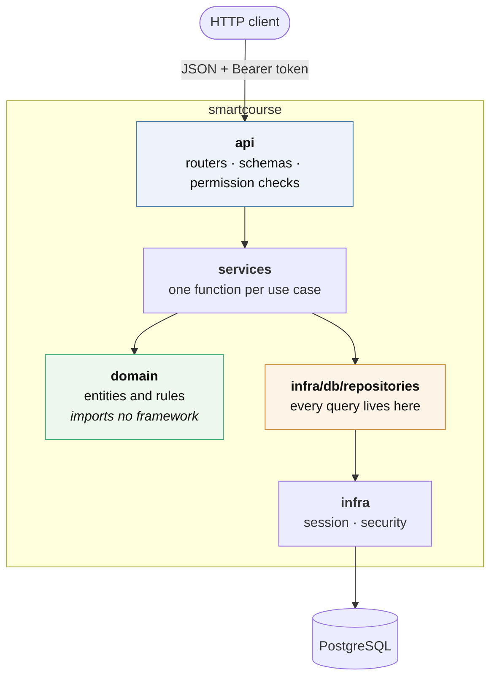

# SmartCourse

Backend for EduCorp's intelligent course delivery platform — a distributed,
event-driven learning system with a GenAI assistant layer.

An eMumba upskilling assignment, September–October 2026.

---

## What it is

EduCorp runs an online learning platform built for far fewer users than it now
has. Publishing a course is slow and manual, course data and analytics
disagree with each other, and busy periods back up enrollments and
notifications.

SmartCourse is a replacement backend. Instructors author courses; students
enrol and work through them; and the slow parts — content processing,
analytics, notifications — happen in the background, reliably, without
blocking anyone.

The full problem statement, use cases, requirements and the assumptions
filling gaps the brief leaves open are in **[docs/PRD.md](docs/PRD.md)**.

---

## Architecture

Four layers. **Imports point inward only.**



**Why the direction matters.** `domain` depends on nothing, so business rules
can be tested without a database or a web server. `services` hold the use
cases and know nothing about HTTP — which is what will let the Temporal
workflows and Celery workers of later modules call exactly the same code,
with no request and no status code to return.

**Three things are separated deliberately:**

| Question | Answered in |
|---|---|
| *Are you an instructor at all?* | `api` — `require_roles` on the route |
| *Is this **your** course?* | `services` — a rule that must hold for callers with no route |
| *How do I fetch that?* | `repositories` — the only place queries are built |

Design decisions, including the options rejected, are in
**[docs/SCHEMA.md](docs/SCHEMA.md)** and **[docs/API.md](docs/API.md)**.

---

## Getting started

**Prerequisites:** [Docker Desktop](https://www.docker.com/products/docker-desktop/)
and [uv](https://docs.astral.sh/uv/).

```bash
git clone git@github.com:faraz-jahangir-emumba/smartcourse-backend.git
cd smartcourse-backend
cp .env.example .env
docker compose up -d
uv sync
uv run alembic upgrade head
uv run uvicorn smartcourse.main:create_app --factory --reload
```

Then open **<http://localhost:8000/docs>** OR **<http://localhost:8000/redoc>**.

> **On a network that intercepts TLS**, `uv` fails with
> `invalid peer certificate: UnknownIssuer`. Set `UV_SYSTEM_CERTS=1` so it
> trusts the operating system's certificate store instead of its own.

---

## API

Everything sits under `/api/v1`. The interactive documentation at **`/docs`**
is generated from the code, so it cannot go stale — including which fields are
required and what each one validates. Click **Schema** rather than **Example
Value** to see required fields marked.

### Authentication and accounts

| | | Who |
|---|---|---|
| `POST` | `/auth/register` | anyone |
| `POST` | `/auth/login` | anyone |
| `GET` | `/users/me` | any signed-in user |
| `PATCH` | `/users/me` | any signed-in user |

`/auth` is for proving who you are. `/users/me` is the account itself — a
thing you read and change — so it lives under its own prefix.

Login returns a bearer token lasting one hour, sent back as
`Authorization: Bearer <token>`, together with the user it belongs to. The
user is already loaded to check the password, so returning it saves every
client an immediate second call.

Registration accepts `student` and `instructor`. **Admin cannot be
self-assigned** — a public endpoint where the caller picks their own role
would let anyone become an admin by editing one field. The same rule applies
to `PATCH /users/me`, or the hole would simply move: register as a student,
then promote yourself.

`PATCH /users/me` changes your name or your roles. Adding `student` to an
instructor account is UC-07 — an instructor who wants to learn keeps one
account rather than opening a second.

**Email cannot be changed**, and sending one returns `422` rather than being
quietly ignored, so a caller is never told a change worked when it did not.
Email is the login identifier: changing it changes who you are to the system.
The consequence is that a mistyped address cannot be repaired by anyone —
there is no admin user endpoint either. That is a known gap, not an oversight.

Password changes have no endpoint yet. Changing one has to prove you know the
current password, or anybody holding a stolen token could lock the real owner
out permanently — which is its own input, its own rules and its own tests.

### Courses, modules and lessons

| | | Who |
|---|---|---|
| `POST` | `/courses` | instructor |
| `GET` | `/courses` | any signed-in user |
| `GET` | `/courses/{id}` | any signed-in user |
| `PATCH` | `/courses/{id}` | the owning instructor |
| `DELETE` | `/courses/{id}` | the owning instructor |
| `POST` | `/courses/{id}/modules` | the owning instructor |
| `GET` | `/modules/{id}` | any signed-in user |
| `PATCH` | `/modules/{id}` | the owning instructor |
| `DELETE` | `/modules/{id}` | the owning instructor |
| `POST` | `/modules/{id}/lessons` | the owning instructor |
| `GET` | `/lessons/{id}` | any signed-in user |
| `PATCH` | `/lessons/{id}` | the owning instructor |
| `DELETE` | `/lessons/{id}` | the owning instructor |

### Three things worth knowing before using it

**Who can see what.** FR-05 promises students browse *published* courses, and
a draft is unfinished by definition.

| | student | instructor, own | instructor, others' | admin |
|---|---|---|---|---|
| `draft` · `publishing` · `failed` | ✗ | ✓ | ✗ | ✓ |
| `ready` | ✓ | ✓ | ✓ | ✓ |

Enforced on every read, including single modules and lessons — filtering a
list achieves nothing if an id still works. A course you may not see returns
**404, not 403**: a 403 would confirm it exists.

**Reads are generous, writes are narrow.** `GET /courses/{id}` returns the
whole course nested, because reading cannot corrupt anything. Changing things
takes one call per thing changed.

**Ordering is set on the parent, as a complete list of ids:**

```json
PATCH /courses/{id}
{ "module_order": ["<module-b>", "<module-a>"] }
```

Never "move this one to position 2" — that is ambiguous between swapping two
items and shifting a run of them, and the two give different results. A
partial list is rejected rather than leaving the rest at stale positions.

### Errors

One shape for every failure, so a client handles them once:

```json
{ "error": { "code": "conflict", "message": "That email is already registered." } }
```

| | |
|---|---|
| `401` | no token, or an invalid one |
| `403` | signed in, but not allowed |
| `404` | no such thing — or nothing you may see |
| `409` | conflicts with the current state |
| `422` | failed validation |

---

## Development

```bash
uv run pytest                                     # the test suite
uv run pytest -v                                  # with test names
uv run alembic revision --autogenerate -m "..."   # a new migration
uv run alembic upgrade head                       # apply migrations
docker compose down                               # stop, keep data
docker compose down -v                            # stop and delete data
```

**44 tests**, and they need Postgres running. Isolation works at two levels: a
throwaway `smartcourse_test` database is created, migrated from empty and
dropped per run — which is also the only thing that checks the migrations work
on a fresh clone — and within it each test runs in a transaction that is
rolled back, so no test can see another's data.

**Always read a generated migration before applying it.** Alembic does not
compare CHECK constraint expressions, so changing one produces an *empty*
migration that silently claims success. Those have to be written by hand.

---

## Project layout

```
src/smartcourse/
├─ api/                 HTTP
│  ├─ routers/          one module per area
│  ├─ schemas/          what crosses the wire, kept apart from the models
│  ├─ deps.py           get_current_user · require_roles · repositories
│  └─ errors.py         the only place that knows ConflictError means 409
├─ domain/              entities and rules; imports no framework
├─ services/            use cases
├─ infra/
│  ├─ db/
│  │  ├─ models/        SQLAlchemy models
│  │  ├─ repositories/  every query
│  │  ├─ migrations/    alembic
│  │  └─ session.py     engine and per-request session
│  └─ security.py       password hashing, token signing
└─ main.py              the application factory

docs/                   PRD · schema · API design
tests/                  pytest suite
```

---

## Tech stack

**Backend** — Python 3.12, FastAPI, PostgreSQL, SQLAlchemy 2.0 (async),
Alembic, Argon2, JWT
**Tooling** — uv, pytest, Docker Compose

Arriving in later modules, per the brief: MongoDB, Redis, Celery with
RabbitMQ, Kafka with Schema Registry, Temporal, OpenTelemetry with Prometheus,
Grafana and Jaeger, then LangGraph and a vector store.

---

## Progress

| Module | | |
|---|---|---|
| **1** | Foundation and core services | **complete** |
| 2 | Enrollment and publishing workflow | not started |
| 3 | Event-driven system and observability | not started |
| 4 | Retrieval layer | not started |
| 5 | AI assistant and streaming | not started |

**Module 1 delivered:** service structure defined, database schema created
(10 tables), basic APIs working (16 endpoints), local setup ready — plus a
44-test suite, which the brief names in its evaluation criteria but no module
budgets time for.

**Not yet built, and deliberately so.** There is no publish endpoint: from
Part A §2 that is a multi-step background workflow with retries and
compensation, not a status change, and it is Module 2's main deliverable.
Setting `status` directly would produce a course marked ready with no
processed content — which Part B's assistant would then find nothing in.

---

## Documentation

- **[docs/PRD.md](docs/PRD.md)** — problem, use cases, numbered requirements,
  traceability, and the assumptions filling gaps the brief leaves open
- **[docs/SCHEMA.md](docs/SCHEMA.md)** — every table and column with the
  reasoning, including the options rejected
- **[docs/API.md](docs/API.md)** — endpoint design and the rules behind it
